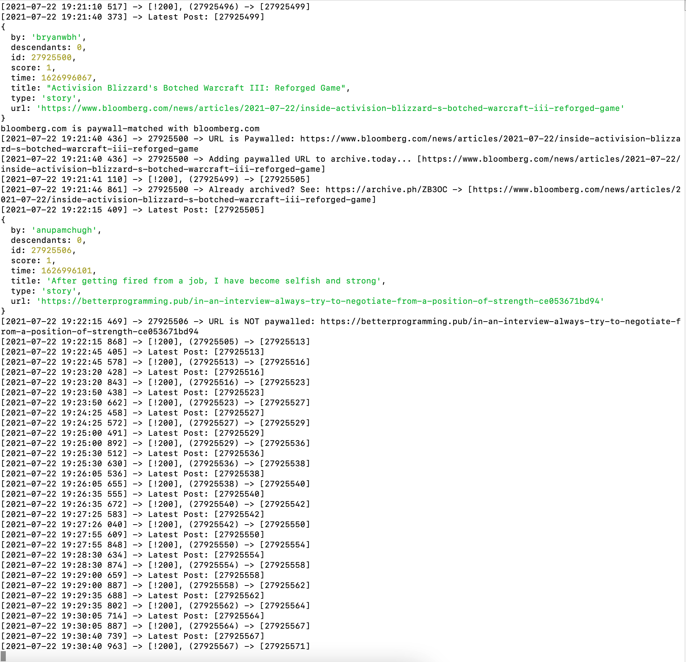
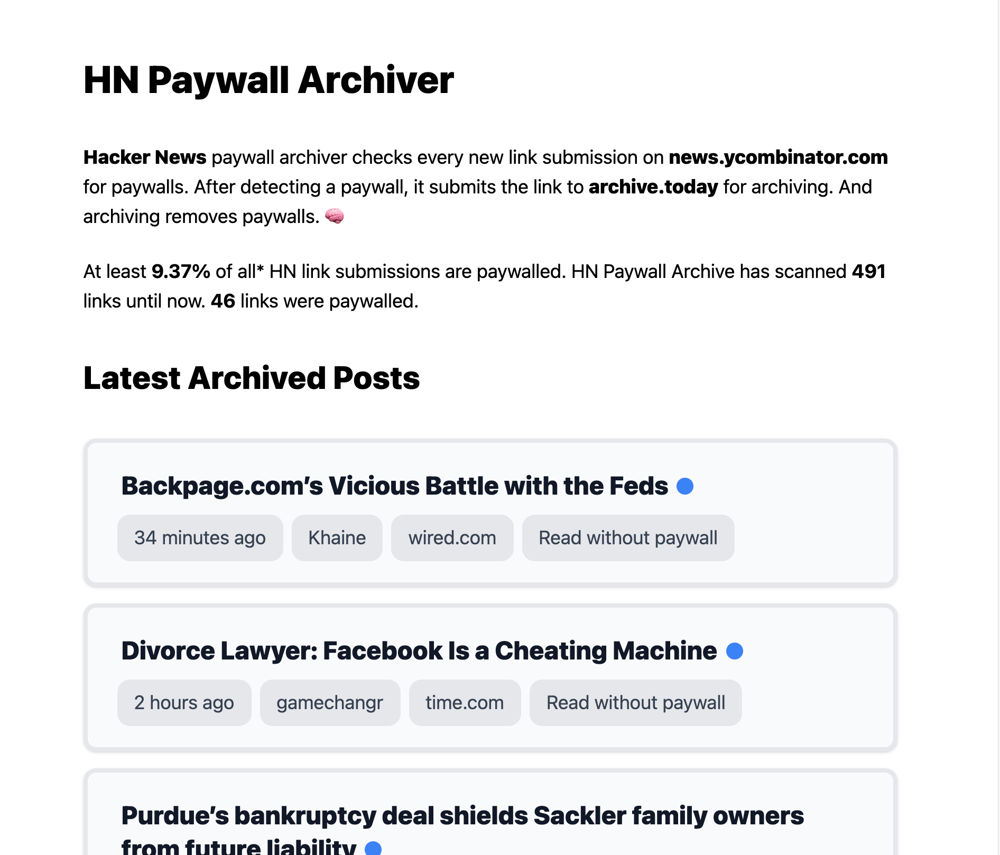

Front-end and stats: [https://hpa.emre.ca](https://hpa.emre.ca)

- [HN Paywall Archiver](#hn-paywall-archiver)
  - [Usage](#usage)
    - [Back-end](#back-end)
    - [Front-end](#front-end)
  - [Screenshots](#screenshots)
    - [Back-end](#back-end-1)
    - [Front-end](#front-end-1)

# HN Paywall Archiver

NodeJS script to submit latest HackerNews posts to Archive.is via Puppeteer and Firebase HackerNews API.

Coded in around 3 hours. Testing took a lot.

Archive.is doesn't have a public API or anything that makes programatically archiving websites easier. ~~At least this is what I thought before finding some code bits on Github and eventually this [Wikipedia article](https://en.wikipedia.org/wiki/Help:Using_archive.today). If I didn't see this, I was going to use Puppeteer which was my initial plan. Everything is too easy now, I kinda feel down.~~ Archive.is doesn't allow remote GET requests, so I decided to go with Puppeteer.

Firebase HN API uses Firebase specific `snapshot` feature instead of Websocket to update the requester automatically. So I decided not to lose time on using their specific way of doing things and just used `setInterval()`.

This script is created to assist my [hnn](https://github.com/MostlyEmre/hnn) project. But I guess it helps humanity as a side effect by archiving the web.

## Usage

### Back-end

- Download the repo
- Open the terminal, `cd` into the folder.
- `node app` to run the script indefinitely.

### Front-end

- Download the repo
- `cd` into `client`
- `npm start` to view the front-end locally. (It receives the data from Firestore)

## Screenshots

### Back-end

### Front-end

